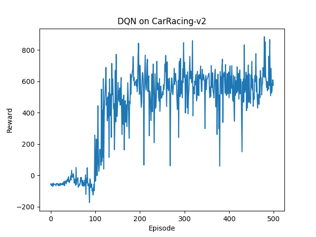

# Deep Q-Network (DQN) Agent — CarRacing-v3 🚗💨

Re-implementation of **“Playing Atari with Deep Reinforcement Learning”**
(Mnih et al., 2015), applied to the **Gymnasium `CarRacing-v3`** environment (discrete action wrapper).


## 🔧 Quick start

```bash
# 1) create / activate an env (optional)
conda create -n carla_dqn python=3.10 -y
conda activate carla_dqn

# 2) install deps
pip install torch \
            gymnasium[box2d] \
            opencv-python-headless \
            matplotlib numpy

# 3) train
python train_dqn.py
# ⇒ dqn_carracing.pth  (weights)
# ⇒ reward_plot.png    (learning curve)
```

## 📝 Hyper-parameters (paper defaults)

| Parameter           | Value                      |
| ------------------- | -------------------------- |
| stacked frames      | **4**                      |
| replay buffer size  | 100 000                    |
| batch size          | 32                         |
| discount γ          | 0.99                       |
| optimizer           | RMSprop (lr 1e-4)          |
| ε-greedy schedule   | 1.0 → 0.1 over 100 k steps |
| target-net sync     | every 1 000 steps          |
| episodes (this run) | 500                        |

---

## 📈 Result


The agent quickly learns to stay on track and accumulates positive reward; performance keeps improving with longer training (try 1–2 M frames).


## 📜 Paper citation

> **Mnih, V.** *et al.* “Playing Atari with Deep Reinforcement Learning.”
> arXiv:1312.5602 (2013).

---

## 📄 License

MIT © 2025 **juwa0** — free to use, modify, and share.
